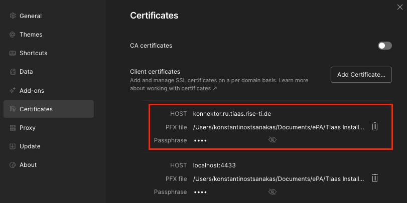
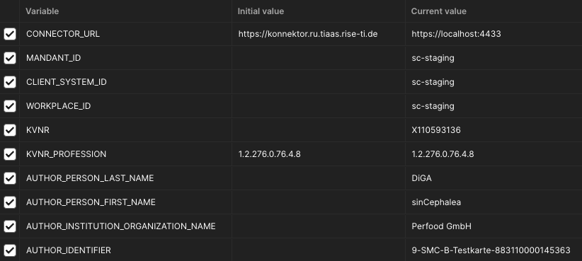

# gematik-epa-postman-collection

This is a Postman-Collection for DiGAs to make requests to the TI-Connector and write into the ePA.

## Requests

- `connector.sds`: Gets the connector service information. You need the `EndpointTLS Location` information to make requests to the service you need.
- `GetCards`: Gets the smc-b cards that are inserted into the card reader.
- `GetPinStatus`: Gets the status of the pin of the card.
- `ReadCardCertificate`:  Reads the certificate of the card. In the certificate extras is the `AUTHOR_IDENTIFIER` you need for the configuration.
- `VerifyPin`: Triggers the pin verification of the card.
- `GetHomeCommunityID`: Gets the home community id of the patient.
- `SaveDocument`: Saves a document in the ePA.
- `UpdateDocument`: Updates a document in the ePA.

## Prerequisites

### Connector certificate

In the Postman settings you need to add your PFX file and passphrase for the connector.




### Collection variables

From the connector configutation:
- `MANDANT_ID`
- `CLIENT_SYSTEM_ID`
- `WORKPLACE_ID`

From the patient (needed for `GetHomeCommunityID`, `SaveDocument` and `UpdateDocument`):
- `KVNR` - The id of the patient you want to write data for: e.g. `X110593136`

From the ePA configuration (needed for `SaveDocument` and `UpdateDocument`):
- `AUTHOR_PERSON_LAST_NAME` - Name of the device: e.g. `DiGA`
- `AUTHOR_PERSON_FIRST_NAME` - Name of the software: e.g. `sinCephalea`
- `AUTHOR_INSTITUTION_ORGANIZATION_NAME` - Name of the organization: e.g. `Perfood GmbH`
- `AUTHOR_IDENTIFIER`
    - Format: `9-SMC-B-Testkarte-XXXXXXXXXXXXXXX`
    - For `XXXXXXXXXXXXXXX` you need the last 15 digits are the `Iccsn` of the card. This number you can get with the `GetCards` request of the collection.



## Good to know

In the `Pre-request Scritp` of the collection all other needed variables for the requests are set.

- `DOCUMENT_ID`: must be in in [RFC4122](http://www.ietf.org/rfc/rfc4122.txt) format e.g. `urn:uuid:73343e0f-df8d-4176-9f29-41d96333df7e`
    - [DocumentEntry.entryUUID](https://profiles.ihe.net/ITI/TF/Volume3/ch-4.2.html#4.2.3.2.7)
    - [UUIDs](https://profiles.ihe.net/ITI/TF/Volume3/ch-4.2.html#4.2.3.1.5)
    - Example JavaScript:
        ```
        const uuid = require('uuid');

        const documentId = `urn:uuid:${uuid.v4()}`
        ```
- `SUBMISSION_SET_ID` & `DOCUMENT_ENTRY_ID`: must be in [OID](https://de.wikipedia.org/wiki/Object_Identifier#Erwerb_einer_OID) format
    - [SubmissionSet.uniqueId](https://profiles.ihe.net/ITI/TF/Volume3/ch-4.2.html#4.2.3.3.12)
    - [XDSDocumentEntry.uniqueId](https://profiles.ihe.net/ITI/TF/Volume3/ch-4.2.html#4.2.3.2.26)
    - Under node 2.25, a UUID can be used as an OID component; no registration is required for this.
        - Example JavaScript:
            ```
            const uuid = require('uuid');

            const oid = `2.25.${BigInt('0x' + uuid.v4().replace(/-/g, '')).toString()}`
            ```